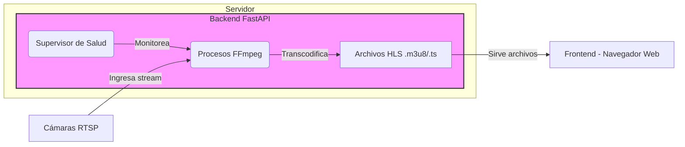

# Real-Time RTSP Camera Grid Viewer


A robust, low-latency web application designed to display a real-time grid of up to 16 RTSP camera streams. This project was engineered as a custom solution to overcome the technical limitations of restrictive client environments (like ChromeOS) where standard NVR software and control scripts fail.

**New in this version:**
- **Ultra-Low Latency WebRTC**: Sub-second latency via go2rtc with automatic HLS fallback
- **Dual Protocol Support**: WebRTC for low latency (~100-500ms), HLS for compatibility (~2-4s)
- **ICE NAT Traversal**: STUN/TURN server support for firewall penetration
- **Easy Deployment**: One-command deployment to DockerHub
- **ChromeOS Ready**: Complete installation guide for ChromeOS/Debian environments

### High-Level Flow


## ✨ Key Features

-   **Live 4x4 Grid**: Displays 16 simultaneous RTSP streams in a clean, browser-based grid.
-   **Ultra-Low Latency WebRTC**: Sub-second latency (~100-500ms) via go2rtc with automatic retry logic and ICE NAT traversal.
-   **Dual Protocol Support**: Toggle between WebRTC (ultra-low latency) and HLS (maximum compatibility) with a single flag.
-   **Self-Healing Backend**: A supervisor thread continuously monitors all video streams. If a stream stalls or an FFmpeg process crashes, it is automatically terminated and restarted to ensure maximum uptime.
-   **Resilient Frontend**: Intelligent connection management with exponential backoff retry logic, automatic reconnection, and graceful error handling.
-   **Optimized HLS Fallback**: Low-latency HLS configuration with 1-second segments for ~2-4 seconds latency when WebRTC isn't available.
-   **Secure**: All sensitive data (camera credentials, IP addresses) is managed via a `.env` file and is never exposed in the codebase or repository.
-   **Dockerized Deployment**: The entire application is containerized with Docker and orchestrated by Docker Compose for a simple, reproducible, one-command deployment on any server.

---

## 🏛️ Architecture Overview

The application follows a client-server model, separating the intensive stream processing work on the backend from the lightweight viewing client on the frontend.


### Backend (FastAPI + FFmpeg)

The backend is a Python server built with the **FastAPI** framework. Its primary responsibilities are:
1.  **Stream Ingestion**: It reads camera configurations from environment variables.
2.  **Transcoding**: For each camera, it launches a dedicated **FFmpeg** subprocess. This process pulls the raw RTSP stream and transcodes it in real-time into the **HLS (HTTP Live Streaming)** format. HLS breaks the video into small `.ts` segments and a `.m3u8` playlist file that web browsers can understand.
3.  **Self-Healing Supervisor**: A background thread actively monitors each FFmpeg process, checking for both crashes and "stale" streams (where video files are no longer being updated). It automatically restarts any failed process.
4.  **File Serving**: The FastAPI server serves the HLS stream files and the main `index.html` frontend.


### Frontend (HTML + hls.js)

The frontend is a single, static `index.html` page with no heavy frameworks.
1.  **Grid Layout**: A simple CSS Grid creates the responsive 4x4 video display.
2.  **Video Playback**: The **`hls.js`** JavaScript library enables HLS playback in standard HTML `<video>` elements.
3.  **Intelligent Refresh**: The frontend includes a "watchdog" that monitors the video stream for stalls. If a stall is detected, it automatically reloads the page to ensure the user is always seeing the freshest possible video.

---

## 🛠️ Tech Stack

-   **Backend**: Python 3.11, FastAPI, Uvicorn
-   **Stream Processing**: FFmpeg (RTSP to HLS), go2rtc (RTSP to WebRTC)
-   **WebRTC Signaling**: go2rtc API server with ICE server support
-   **Frontend**: HTML5, CSS3, JavaScript (with hls.js and native WebRTC)
-   **Deployment**: Docker & Docker Compose, Supervisor (process management)

---

## ⚙️ Configuration

All sensitive configuration is managed through a `.env` file in the project root. To get started, copy the example file:
```bash
cp .env.example .env
Then, edit the .env file with your specific camera details. The .env file is included in .gitignore and will not be committed to the repository.
```

## 🚀 Quick Start

### For Developers (Build and Push to DockerHub)

1.  **Clone and configure:**
    ```bash
    git clone [your-repo-url]
    cd cctv-viewer-fastapi
    cp .env.example .env
    # Edit .env with your camera credentials
    ```

2.  **Deploy to DockerHub:**
    ```bash
    ./deploy.sh your-dockerhub-username
    ```

### For End Users (ChromeOS/Debian)

See **[DEPLOYMENT.md](DEPLOYMENT.md)** for complete installation instructions.

**Quick version:**
```bash
# 1. Install Docker
bash install-docker-chromeos.sh

# 2. Close and reopen terminal

# 3. Run the application
bash quick-start.sh
```

### For Local Development

```bash
# Install Python dependencies
pip install -r requirements.txt

# Create .env file with your camera configuration
cp .env.example .env

# Run the application
uvicorn main:app --reload
```

---

## 🖥️ Usage

Once the container is running, open your web browser and navigate to:

`http://<server_ip>:8000`

(If running on your local machine, use `http://localhost:8000`).

The 16 camera streams will load into the grid.

---

## 📋 Available Scripts

-   `deploy.sh [dockerhub-user]` - Build and push image to DockerHub
-   `install-docker-chromeos.sh` - Install Docker on ChromeOS/Debian
-   `quick-start.sh` - Quick deployment script for end users

## 🐛 Troubleshooting

See [DEPLOYMENT.md](DEPLOYMENT.md) for detailed troubleshooting steps.

Common issues:
-   **Streams not loading**: Check camera credentials in `.env`
-   **High latency**: Verify network bandwidth and camera settings
-   **Docker issues**: Ensure Docker service is running

## 📚 Documentation

-   [DEPLOYMENT.md](DEPLOYMENT.md) - Complete deployment guide for ChromeOS/Debian
-   [.env.example](.env.example) - Environment configuration template

## 🔮 Future Improvements

-   **User Authentication**: Login system with FastAPI security
-   **Dynamic Grid**: Configurable camera layouts (2x2, 3x3, 4x4, etc.)
-   **Recording**: DVR functionality with playback
-   **Mobile App**: Native iOS/Android applications
-   **Advanced Analytics**: Motion detection and event triggers
