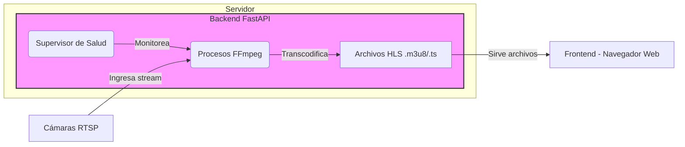

# Real-Time RTSP Camera Grid Viewer


A robust, self-healing web application designed to display a real-time grid of up to 16 RTSP camera streams. This project was engineered as a custom solution to overcome the technical limitations of restrictive client environments (like ChromeOS) where standard NVR software and control scripts fail.

### High-Level Flow


## ✨ Key Features

-   **Live 4x4 Grid**: Displays 16 simultaneous RTSP streams in a clean, browser-based grid.
-   **Self-Healing Backend**: A supervisor thread continuously monitors all video streams. If a stream stalls or an FFmpeg process crashes, it is automatically terminated and restarted to ensure maximum uptime.
-   **Resilient Frontend**: The JavaScript player intelligently detects stream interruptions and automatically attempts to reconnect, providing a seamless viewing experience without requiring a manual page refresh.
-   **Low Latency**: Uses FFmpeg to transcode RTSP to HLS with optimized parameters, balancing stream stability with a low delay (~5-6 seconds).
-   **Secure**: All sensitive data (camera credentials, IP addresses) is managed via a `.env` file and is never exposed in the codebase or repository.
-   **Dockerized Deployment**: The entire application is containerized with Docker and orchestrated by Docker Compose for a simple, reproducible, one-command deployment on any server.

---

## 🏛️ Architecture Overview

The application follows a client-server model, separating the intensive stream processing work on the backend from the lightweight viewing client on the frontend.


### Backend (FastAPI + FFmpeg)

The backend is a Python server built with the **FastAPI** framework. Its primary responsibilities are:
1.  **Stream Ingestion**: It reads camera configurations from environment variables.
2.  **Transcoding**: For each camera, it launches a dedicated **FFmpeg** subprocess. This process pulls the raw RTSP stream and transcodes it in real-time into the **HLS (HTTP Live Streaming)** format. HLS breaks the video into small `.ts` segments and a `.m3u8` playlist file that web browsers can understand.
3.  **Self-Healing Supervisor**: A background thread actively monitors each FFmpeg process, checking for both crashes and "stale" streams (where video files are no longer being updated). It automatically restarts any failed process.
4.  **File Serving**: The FastAPI server serves the HLS stream files and the main `index.html` frontend.


### Frontend (HTML + hls.js)

The frontend is a single, static `index.html` page with no heavy frameworks.
1.  **Grid Layout**: A simple CSS Grid creates the responsive 4x4 video display.
2.  **Video Playback**: The **`hls.js`** JavaScript library enables HLS playback in standard HTML `<video>` elements.
3.  **Intelligent Refresh**: The frontend includes a "watchdog" that monitors the video stream for stalls. If a stall is detected, it automatically reloads the page to ensure the user is always seeing the freshest possible video.

---

## 🛠️ Tech Stack

-   **Backend**: Python 3.11, FastAPI, Uvicorn
-   **Stream Processing**: FFmpeg
-   **Frontend**: HTML5, CSS3, JavaScript (with hls.js)
-   **Deployment**: Docker & Docker Compose

---

## ⚙️ Configuration

All sensitive configuration is managed through a `.env` file in the project root. To get started, copy the example file:
```bash
cp .env.example .env
Then, edit the .env file with your specific camera details. The .env file is included in .gitignore and will not be committed to the repository.
```

## 🚀 Setup and Installation (Docker)

This application is designed to be run with Docker.

### Prerequisites
-   Git
-   Docker and Docker Compose

### Steps
1.  **Clone the repository:**
    ```bash
      git clone [https://github.com/YOUR_USER/YOUR_REPO.git](https://github.com/YOUR_USER/YOUR_REPO.git)
    cd YOUR_REPO
    ```

2.  **Create your environment file:**
    Create a file named `.env` and fill it with your camera credentials and IP, following the format in `.env.example`.

3.  **Build and run the container:**
    Use Docker Compose to build the image and run the container in the background.
    ```bash
    docker compose up --build -d
    ```

---

## 🖥️ Usage

Once the container is running, open your web browser and navigate to:

`http://<server_ip>:8000`

(If running on your local machine, use `http://localhost:8000`).

The 16 camera streams will load into the grid.

---

## 🔮 Future Improvements (v2.0)

-   **Migration to WebRTC**: To achieve true real-time latency (<1 second), the next major version will replace the HLS transcoding pipeline with a **WebRTC gateway** using a tool like `go2rtc`.
-   **User Authentication**: Implement a login system using FastAPI's security features to restrict access.
-   **Dynamic Grid**: Allow users to select which cameras to display and in what layout.
